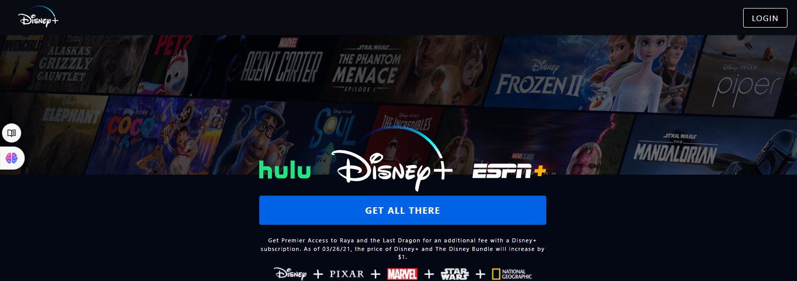

# Disney Plus Clone

A highly functional and responsive clone of the Disney Plus streaming platform built with **React**, **Redux**, and **Styled Components**. This project integrates **Firebase** for user authentication and database services. The goal was to recreate the core functionalities of Disney Plus with a modern web development stack, ensuring scalability and ease of maintainability.

## Demo

You can check the live demo of the project here:
[Disney Plus Clone Demo](https://disney-pluse-clone-29812.web.app/)

## Features

- **User Authentication**: Fully integrated user login and signup with **Firebase Authentication**.
- **Responsive Design**: The entire app is responsive, providing a seamless experience across mobile, tablet, and desktop devices.
- **Styled Components**: CSS-in-JS with **Styled Components** allows for scoped and dynamic styles based on props and global themes.
- **Redux**: Managed application state with **Redux**, ensuring scalable and maintainable state across the app.
- **Movie Data**: Dynamically fetches and displays data using Firebase's real-time database.
- **Smooth Navigation**: Includes navigation between different sections and details pages for individual movies.
- **Dynamic Content Rendering**: Fetches and displays movie details, banners, and posters based on real-time database updates.

## Technologies Used

- **React**: A JavaScript library for building user interfaces, handling the view layer of the app.
- **Redux**: A predictable state container for managing global state across the app.
- **Firebase**: Backend-as-a-Service (BaaS) used for user authentication and real-time database management.
- **Styled Components**: A library for writing CSS-in-JS, providing a styled UI with scoped component-level styles.
- **JavaScript (ES6+)**: Modern JavaScript features were used for cleaner, more readable code.
- **HTML5 & CSS3**: For structuring the web pages and styling the application.

## Screenshots

### Login page

### Home Page

### Movie Details Page

